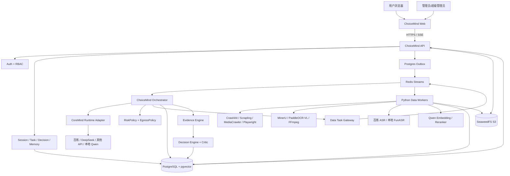
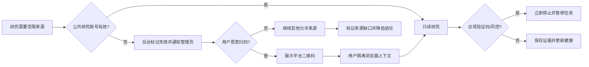
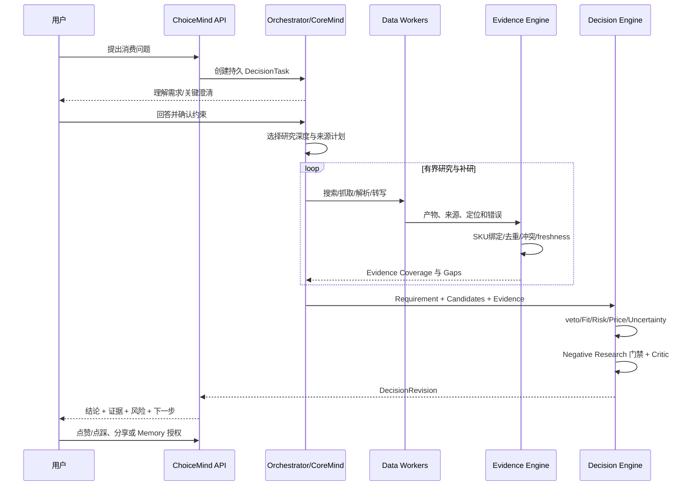
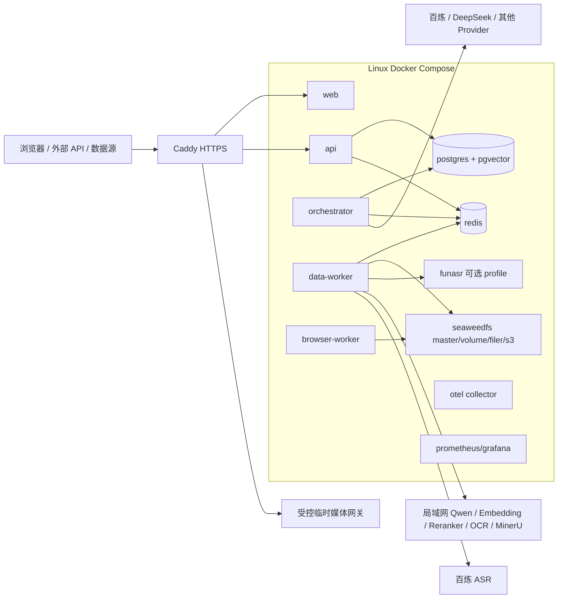

# ChoiceMind 星枢智购 V1.0：智能体构建解决方案

> 本方案落实《[ChoiceMind 星枢智购：产品与研发规格书 V1.2](./ChoiceMind_星枢智购_产品与研发规格书_v1.2.md)》，描述 V1.0 完成态的技术架构、CoreMind 集成、开源选型、部署、分期和验收。

| 属性 | 内容 |
| --- | --- |
| 方案版本 | V1.0 Solution / 2026-08-12 |
| 产品形态 | Web 端智能消费决策智能体 |
| 开发/验证 | Windows + Docker Desktop |
| 最终部署 | Linux + Docker Compose |
| 规模目标 | 100 注册用户、20 同时在线、10 并行 Deep Research |
| 研发方式 | 一人全栈，按纵向切片交付 |
| 运行框架 | CoreMind Node Runtime |
| CoreMind 参考基线 | GitHub 预发布版 `v0.3.0-rc.2`，提交 `2460f185d23252b0b7097510b6604c0685ea7494`，Protocol v1 |
| 核心边界 | 决策与交易前辅助；不建设支付、订单、物流或自动交易 |

## 1. 方案结论

ChoiceMind 应建设为“一个 Orchestrator + 多个深模块 + 可替换 Adapter”的智能体，而不是一组彼此对话的常驻 Agent，也不是把爬虫、RAG 和聊天页面简单拼接。

最重要的责任划分是：

- **CoreMind** 负责模型循环、工具调用、运行事件、安全恢复判断、checkpoint、Effect Receipt、权限和 Provider 适配；
- **ChoiceMind Node API/Runtime** 负责用户、领域状态、研究计划、证据门禁、Decision、Memory、分享和管理后台；
- **Python Data Worker** 负责爬取、浏览器、文档、OCR、音视频、Embedding 和 Rerank 等数据任务；
- **PostgreSQL** 保存权威业务状态；Redis 只负责传输、缓存、限流和短期协调；
- **Evidence** 是 Decision 的一等输入，LLM 不能用内部记忆替代当前事实；
- **RiskPolicy**、用户隔离和秘密保护位于模型之外，任何模型或管理员都不能覆盖。

## 2. 架构驱动因素

| 驱动因素 | 对架构的要求 | 需求映射 |
| --- | --- | --- |
| 品类不设固定上限 | 核心只理解通用领域对象，差异进入 Category Package | FR-004 |
| 必须获取真实数据 | 数据源 Adapter、浏览器会话、健康和真实样本认证 | FR-006、FR-007 |
| 结论必须可验证 | Claim/Evidence Graph、来源定位、冲突和 freshness | FR-009-012 |
| 外部模型主用、本地备用 | CoreMind Provider + ChoiceMind 路由与认证矩阵 | FR-016 |
| 私人数据可控 | CredentialVault、Consent、用户隔离和删除流水线 | FR-001/014/018 |
| 用户可离开页面 | 持久任务、Outbox、Redis Streams、SSE 和 checkpoint | FR-002 |
| 一人全栈 | 单仓库、少量技术栈、成熟组件、无 Kubernetes | NFR-008/011 |
| 不做电商交易 | 领域和 API 中不存在 Cart、Order、Payment、Shipment | 第 3.2 节 |

## 3. 总体架构



### 3.1 为什么不采用固定多 Agent 群

消费决策共享同一个 Requirement、Candidate、Evidence 和 Decision 状态。固定多 Agent 容易重复抓取、丢失 Hard Constraint、在不同上下文中产生冲突结论，并显著增加成本。

本方案保留“角色化能力”，但把它们实现为有输入输出合同的 Skill/Module：Requirement Profiler、Market Scout、Evidence Research、Negative Research、Price、User Fit 和 Critic。Orchestrator 根据状态和 Evidence Gap 调用，不让它们拥有相互独立的业务真相。

### 3.2 深模块原则

模块的接口要小而稳定，复杂性留在实现内部：

- Orchestrator 只看到 `ResearchTask` 和 `TaskResult`，不知道 Crawl4AI 或 MediaCrawler 的内部参数；
- Decision Engine 只读取结构化对象，不直接打开网页或调用模型；
- Evidence Store 负责证据定位、去重、冲突和版本，调用者不关心 SQL 表；
- Credential Vault 只暴露“在受控执行上下文中使用秘密”，不返回明文；
- Python Worker 只完成数据任务，不拥有最终 Decision 状态。

## 4. CoreMind 集成方案

### 4.1 当前框架事实

2026-08-12 对 `Eclipseic1848/CoreMind` 的复核基于 GitHub 预发布版
[`v0.3.0-rc.2`](https://github.com/Eclipseic1848/CoreMind/releases/tag/v0.3.0-rc.2)，对应提交
[`2460f185d23252b0b7097510b6604c0685ea7494`](https://github.com/Eclipseic1848/CoreMind/tree/2460f185d23252b0b7097510b6604c0685ea7494)：

- 当前版本仍是 Release Candidate，不得描述为稳定版；GitHub Release 已存在，npm/PyPI 安装可用性仍须在 P0 分别实测；
- 主 Runtime 为 TypeScript/Node；
- Protocol 仍为 v1，但 `RunSnapshot` 的 operation、outcome、metrics、trace、checkpoint、artifact 和 extension receipt 已改为完整嵌套 Schema 校验；
- `RunSnapshot.resumable` 只有在运行暂停且所有未完成副作用均有安全收据时才为 `true`，外部业务系统不保证“恰好一次”；
- Provider 凭据只从调用方显式注入环境读取；指定 `apiKeyEnv` 后，不回退宿主环境、凭据文件或默认变量；
- 支持 Provider 配置、自定义 OpenAI 兼容端点、Harness/Loop、事件、checkpoint 和 Effect Receipt 等运行能力；
- 当前 40 个 Provider 可配置，只有 `alibaba-model-studio/qwen-plus` 具备本版本完整真实认证记录；DeepSeek 仍需 ChoiceMind 自己完成发布认证。

因此，ChoiceMind 不应 Fork CoreMind 或复制 Runtime，而应通过窄适配层集成，并把 ChoiceMind 的发布认证独立保存在本仓库。

### 4.2 集成边界

```text
ChoiceMind Domain
  └─ AgentRuntimePort
       └─ CoreMindAgentRuntimeAdapter
            ├─ run(task) -> RuntimeRunResult
            ├─ resume(taskId, runId) -> RuntimeRunResult
            ├─ cancel(taskId)
            └─ streamEvents(taskId, cursor)
```

`AgentRuntimePort` 由 ChoiceMind 定义，`CoreMindAgentRuntimeAdapter` 映射 CoreMind 的公开接口。Provider 环境、工具定义、RunStore 和事件回调均由 Adapter 内部组装，不扩散到领域调用方。`RuntimeRunResult` 只暴露 `runId`、稳定终态、恢复许可和不可变快照引用；快照引用只包含 schema version、对象引用和 SHA-256，不复制 CoreMind 的嵌套字段。Adapter 必须使用 CoreMind Protocol v1 校验完整 `RunSnapshot`，不得自行拼装弱化快照。

领域工具通过 CoreMind 的 `toolDefinitions` 注入并由 Adapter 封装，不把底层 Agent 或 Provider 私有类型暴露到 `AgentRuntimePort`。CoreMind 升级时，只修改 Adapter 和合同测试，不让变化扩散到 Decision、Evidence 或 Web。

### 4.3 状态所有权

| 状态 | 权威所有者 | 说明 |
| --- | --- | --- |
| 用户、角色、Session、Memory | ChoiceMind/PostgreSQL | CoreMind 只接收最小任务上下文。 |
| Requirement、Candidate、Evidence、Decision | ChoiceMind/PostgreSQL | 结构化、版本化、可重放。 |
| 模型执行步骤、工具调用事件 | CoreMind Runtime | 同步写入 ChoiceMind RunEvent 投影。 |
| `RunSnapshot`、Trace、Effect Receipt | CoreMind 产生，ChoiceMind 不可变保存 | 保存经 Protocol 校验的原始快照或内容寻址引用；业务层只读取投影，不改写 Runtime 事实。 |
| checkpoint 元数据 | ChoiceMind + CoreMind 引用 | 业务 checkpoint 与 Runtime checkpoint 关联；checkpoint 存在不等于允许 resume。 |
| 原始网页/文件/截图 | SeaweedFS | Postgres 只保存对象引用和证据定位。 |
| Python 临时工作目录 | Worker 临时盘 | 任务完成后清理，不作为真相。 |

ChoiceMind `operation_id` 与 CoreMind `operationId` 建立一对一关联，并保留 `runId`、`correlationId`、`callId`、`idempotencyKey` 和 checkpoint 引用。只有经校验快照的 `resumable=true` 才能触发 `resume`；ChoiceMind 不根据单个 checkpoint 或 UI 状态自行推断可恢复性。

### 4.4 CoreMind 工具接入

ChoiceMind 向 CoreMind 注册的是领域工具，不是具体爬虫命令，例如：

```text
discover_sources(requirement, source_policy) -> SourceCandidate[]
collect_source(source_ref, credential_ref?) -> CollectionResult
parse_artifact(object_ref, parse_profile) -> ParsedArtifact
transcribe_media(object_ref, consent_ref?) -> Transcript
retrieve_evidence(query, filters) -> EvidenceHit[]
persist_claims(task_id, claims[]) -> EvidenceMutationResult
```

工具结果统一为：

```ts
type ToolResult<T> =
  | { ok: true; data: T; metrics: ToolMetrics; provenance: Provenance }
  | { ok: false; error: ToolError; retryable: boolean; partial?: T; metrics: ToolMetrics };
```

禁止捕获异常后返回 `ok: true`；`partial` 不能使任务进入权威完成态。

## 5. 技术栈

### 5.1 单仓库

| 层 | 默认选型 | 选择理由 |
| --- | --- | --- |
| 包管理 | pnpm workspace | 与 TypeScript/CoreMind 生态一致，单人维护简单。 |
| Web | Next.js + TypeScript | 路由、SSR、响应式 Web 和生态成熟；不建设 PWA。 |
| UI | Tailwind CSS + shadcn/ui | 复用成熟组件且保留源码可控性。 |
| 客户端数据 | TanStack Query + 原生 EventSource | 普通 API 缓存与 SSE 状态分工清楚。 |
| Node API | Fastify + Zod/OpenAPI | 边界校验清晰，开销和样板少于重型框架。 |
| 认证 | Better Auth + ChoiceMind Invite/RBAC | 复用密码、Session 等基础能力，只自建邀请码和权限规则。 |
| 数据访问 | Drizzle ORM + SQL migration | TypeScript 友好，并允许直接使用 pgvector 和约束。 |
| Python Worker | FastAPI/Pydantic + redis-py | 便于复用 Python 爬虫/AI 工具，并通过 Schema 保持合同。 |
| 测试 | Vitest、Playwright、pytest、Testcontainers | 覆盖 TS、Web、Python、数据库和集成。 |

业务依赖版本不在方案中逐项写死；CoreMind 参考基线 `v0.3.0-rc.2` 要求 Node.js `>=22.19.0`。P0 必须分别验证 GitHub Release、npm/PyPI 实际安装、公开类型合同和 Windows/Linux 运行，再在 lockfile 与依赖决策记录中固定精确版本；不得依赖 `main`，也不得因为安装失败静默换版本或镜像。

### 5.2 基础设施

| 能力 | V1.0 默认 | 边界 |
| --- | --- | --- |
| 权威数据库 | PostgreSQL | Session、任务、事件、checkpoint、Decision、Memory、配置和审计。 |
| 初始向量库 | pgvector | 与业务事务和删除一致；没有真实瓶颈前不引入第二套向量真相。 |
| 任务/事件传输 | Redis Streams + consumer group | 不是权威存储；使用 Postgres Outbox 防止任务丢失。 |
| 缓存/限流 | Redis | 可丢弃重建，不保存唯一业务事实。 |
| 对象存储 | SeaweedFS S3 API | 原始资料、截图、关键帧、报告和用户上传。 |
| 反向代理/TLS | Caddy | Linux 生产统一入口和 TLS；开发可直接访问。 |
| 可观测 | OpenTelemetry + Prometheus + Grafana + 结构化日志 | 指标、Trace 和日志共享 task/source/provider 关联 ID。 |
| 秘密加密 | libsodium + Docker secret 提供主密钥 | 不自创加密算法；密文和主密钥分离。 |

只有出现实测 SLO 问题时才升级：向量规模/延迟不达标时评估 Qdrant；中文全文检索不达标时评估 OpenSearch；队列吞吐/交付语义不足时评估更强消息系统；V1.0 不做双写。

## 6. 模块与稳定接口

### 6.1 模块图

| 模块 | 对外接口 | 隐藏的复杂性 |
| --- | --- | --- |
| Identity | `IdentityService` | 邀请、密码、Session、RBAC、账号删除。 |
| Agent Runtime | `AgentRuntimePort` | CoreMind 版本、模型 loop、工具回调、RunSnapshot、Effect Receipt 和安全恢复。 |
| Model Gateway | `ModelProvider` | Provider、Base URL、能力、密钥、路由、备用和认证。 |
| Research | `ResearchPlanner` | 深度、预算、来源计划、Evidence Gap 和有界补研。 |
| Data Source | `DataSourceConnector` | 搜索、平台页面、登录、分页、限流和失败分类。 |
| Browser Session | `BrowserSessionBroker` | 管理员/用户登录态、二维码、隔离上下文和 Cookie 注入。 |
| Document | `DocumentParser` | MinerU、OCR、格式检测、版面、表格和失败。 |
| Speech | `SpeechTranscriptionProvider` | 百炼、本地 FunASR、临时 URL、同意和分段时间戳。 |
| Retrieval | `EmbeddingProvider` / `Reranker` | 批量、截断、维度、模型版本和降级。 |
| Evidence | `EvidenceStore` | Claim、来源、去重、冲突、freshness、证据图和定位。 |
| Decision | `DecisionEngine` / `DecisionCritic` | veto、Fit、Risk、Price、Gap、敏感性和状态。 |
| Memory | `MemoryService` | 总授权、逐项敏感确认、revision、导出和级联删除。 |
| Secrets | `CredentialVault` | envelope encryption、轮换、用途限制和审计。 |
| Storage | `ObjectStore` / `VectorIndex` | SeaweedFS/pgvector 实现与未来替换。 |
| Tasks | `TaskTransport` | Postgres Outbox、Redis Streams、幂等和 consumer recovery。 |
| Safety | `RiskPolicy` / `EgressPolicy` | 硬拒绝、同意、数据最小化和不可绕过规则。 |

### 6.2 Python 任务合同

Python 不运行第二套智能体。Node 发布显式任务，Python 返回显式结果：

```json
{
  "task_id": "dt_123",
  "operation_id": "op_456",
  "kind": "collect_source",
  "input_ref": "source_789",
  "policy": {
    "user_id": "usr_...",
    "credential_ref": "cred_...",
    "read_only": true,
    "max_bytes": 52428800,
    "deadline_at": "..."
  },
  "schema_version": 1
}
```

Worker 结果必须包含 `operation_id`、状态、产物引用、provenance、指标和结构化错误。重复消费同一个 `operation_id` 不得重复抓取或重复写入。

## 7. 数据获取方案

### 7.1 开源组件分工

| 组件 | 默认职责 | 不承担 |
| --- | --- | --- |
| Crawl4AI | 通用网页、动态页面、正文和链接发现 | 不直接承担社交平台账号治理。 |
| Scrapling | 结构化页面抽取、选择器变化适应和轻量抓取 | 不绕过验证码或访问控制。 |
| MediaCrawler | 非商业研究中的小红书、抖音、B站、知乎等平台读取 | 不扩展到互动、私信、订单或账号操作。 |
| Playwright | 受控浏览器、二维码登录、页面截图和特定电商适配 | 不作为反风控攻击工具。 |
| Firecrawl | 可选的通用抓取 Adapter 或托管备用 | 与现有能力重叠，不进入 V1.0 必需路径。 |
| FFmpeg | 提取音轨、抽帧和媒体归一 | 不做内容判断。 |

MediaCrawler 官方用途限制与当前“无商业化计划”相容，但仍必须遵守平台条款、访问频率和当地法律。一旦计划商业化，必须在继续使用前重新完成许可证和合规评审。

### 7.2 Source Adapter

```text
DataSourceConnector
├─ OfficialWebConnector
├─ GeneralWebConnector
├─ XiaohongshuConnector
├─ DouyinConnector
├─ BilibiliConnector
├─ ZhihuConnector
├─ JdConnector
├─ TaobaoTmallConnector
├─ PinduoduoConnector
└─ OptionalWeiboTiebaConnector
```

每个 Connector 提供相同能力描述：

- 是否支持公开匿名读取；
- 是否需要管理员或用户登录态；
- 搜索、详情、评论、作者公开页等能力矩阵；
- 限流、并发、最大页数和停止条件；
- 结构版本、最近真实认证时间和健康状态；
- `AUTH_EXPIRED`、`QR_REQUIRED`、`CAPTCHA_REQUIRED`、`RATE_LIMITED`、`ACCESS_DENIED`、`STRUCTURE_CHANGED` 等统一错误。

### 7.3 登录与 Cookie 生命周期



Cookie 的安全实现：

- 浏览器生成 `storageState` 后立即交给 Credential Vault 加密；
- 持久磁盘不保存可复用明文 Cookie；Worker 仅在任务临时目录解密使用；
- 用户凭证只能用于本人任务；公共账号只能用于管理员批准的平台用途；
- 后台只显示别名、状态、最近验证和失效原因；
- 若用户不扫码，系统仍可使用官网、搜索、公开页和其他已授权来源，但必须把该平台证据缺口呈现给用户，不能补造。

### 7.4 抓取质量门

数据进入 Evidence Engine 前依次通过：

1. 来源策略与登录权限；
2. MIME、大小、恶意文件和 URL 安全检查；
3. 原始对象内容寻址保存；
4. 解析和结构校验；
5. 产品/SKU/市场身份绑定；
6. 转载/重复聚类；
7. Claim 抽取及来源定位；
8. freshness 和商业偏见标注；
9. 提示注入隔离；
10. Evidence Gap 更新。

## 8. 多模态、RAG 与证据

### 8.1 本地服务适配

| Adapter | 当前端点 | 调用合同 | 注意事项 |
| --- | --- | --- | --- |
| LocalChatModel | `192.168.121.32:6012` | OpenAI 兼容 Chat/Responses | 禁用不需要的 reasoning 以控制输出；正式认证后启用。 |
| LocalEmbedding | `192.168.121.33:8008` | `/v1/embeddings` | 当前最小实测为 2560 维；维度写入索引元数据。 |
| LocalReranker | `192.168.121.33:8012` | `/v1/rerank` | 服务报告最大长度 1024；先切片再排序并测试截断。 |
| PaddleOcrVl | `192.168.121.33:18080` | OpenAI 兼容视觉消息 | 它是 OCR-VL，不命名为 MinerU。 |
| MinerU | `192.168.121.33:8000` | `/file_parse`、`/tasks/*` | 优先异步任务接口；保留版本、backend 和解析参数。 |

所有端点都由后台配置，不在业务代码中写死。开发默认值放在本地 `.env.example`，真实地址和秘密不提交仓库。

### 8.2 文档与媒体流水线

```text
URL / 用户上传 / 平台媒体
  → 原始对象和哈希
  → MIME/大小/安全检查
  → 文档: MinerU + OCR
     图片: OCR-VL + 视觉描述
     视频: 字幕 + FFmpeg 音轨/关键帧 + ASR
  → 带页码/区域/时间点的 ParsedArtifact
  → 语义切片
  → Embedding + Rerank
  → Claim/Evidence 抽取
  → Evidence Graph
```

Embedding 和 Reranker 只帮助召回与排序，不能把相似度当成事实可信度。最终 Claim 必须保留原文定位。

### 8.3 ASR 双通道

默认实现：

- `BailianSpeechTranscriber`：主服务，非实时长文件模型；
- `FunAsrSpeechTranscriber`：本地备用，OpenAI 兼容 `/v1/audio/transcriptions`；
- `SpeechTranscriptionRouter`：依据数据性质、同意、管理员优先级、健康和错误类型选择。

长文件交给百炼时需要公网可读取的临时 URL。实现 `BailianMediaBridge`：

1. 从 SeaweedFS 读取受控对象；
2. 生成短时效、不可枚举、限定单对象的 HTTPS 下载令牌；
3. 若本机对象网关无法被百炼访问，则使用后台配置的临时 OSS 交接桶；
4. 调用完成或超时后撤销令牌/删除临时对象；
5. 审计只记录对象引用、Provider、目的、同意和结果，不记录签名 URL。

私人文件只有存在有效 `CloudProcessingConsent` 才可走百炼；否则 Router 直接选本地，不先尝试云端。

### 8.4 Evidence 数据模型要点

最小表组：

- `sources`：平台、URL、内容 ID、作者/机构、公开时间、抓取时间、市场；
- `artifacts`：对象引用、哈希、类型、保留策略、解析版本；
- `evidence_spans`：页码、文本范围、截图区域、视频时间点；
- `claims`：subject、predicate、value、类型、状态、适用 SKU 和有效时间；
- `claim_evidence_edges`：支持/反驳、直接性和抽取版本；
- `source_clusters`：转载/同源聚类；
- `evidence_conflicts`：冲突组、状态和需要补研的问题；
- `price_observations`：SKU、卖家、条件、价格、库存和时效；
- `risk_findings`：严重度、可能性、影响人群、缓解和证据强度。

关键事实的用户界面不显示抽象“模型置信度”即可结束，而要提供 `[E12]` 等可点击证据、片段/截图/时间点、来源日期、抓取日期和适用 SKU。

### 8.5 两类 Evidence 不得混用

- **ChoiceMind Evidence**：来自官网、说明书、平台页面、文档、图片或音视频，经过来源绑定和领域校验，可支持或反驳消费决策 Claim。
- **CoreMind Runtime Execution Evidence**：`tool_execution_evidence`、`engineering_evidence`、Trace、checkpoint 和 Effect Receipt，用于运行验真、恢复和审计。

Runtime Execution Evidence 不能直接进入 Claim/Evidence Graph。只有领域工具产出的内容经过 `Source → Artifact → Evidence Span → Claim` 流程后，才能成为消费决策依据；前端状态流只投影允许公开的归一化事件，不展示工具秘密、完整参数或模型私有思维链。

## 9. 模型与 Provider 架构

### 9.1 统一配置

```text
ProviderConfig
├─ provider_type
├─ base_url
├─ model_id
├─ credential_ref          # 仅供 ChoiceMind CredentialVault 解析
├─ capabilities
│   ├─ text
│   ├─ vision
│   ├─ tool_calling
│   ├─ json_schema
│   └─ streaming
├─ enabled
├─ platform_or_byok
├─ certification_status
├─ timeout / max_calls_per_task
└─ fallback_order
```

`credential_ref` 不直接传入 CoreMind。`CoreMindAgentRuntimeAdapter` 在每次运行开始时从 CredentialVault 解密当前平台或用户所需密钥，构造仅包含本次 Provider 所需变量的临时 `env`，再显式传入 CoreMind；禁止修改全局 `process.env`，禁止不同用户或不同运行复用可变凭据对象。

V1.0 可配置 Provider：百炼/Qwen、DeepSeek、Moonshot/Kimi、Z.ai/GLM、小米 MiMo、OpenAI、xAI、Anthropic，并保留 Gemini/OpenRouter 扩展。后台必须使用真实 API 术语，不能把 ChatGPT 或 Claude Code 客户端产品名称当成模型 ID。

### 9.2 路由策略

- 管理员配置平台默认主模型和批准的备用链；
- 用户配置 BYOK 后可选择自己的 Provider；
- 平台密钥全局停用时，使用 BYOK 或本地免费 Qwen；
- 不建设按用户计费额度，只限制单任务最大调用数、总时长和有界补研次数；
- 结构化抽取要求 JSON Schema；不支持时不得假装能力可用；
- Provider 失败进入事件流，自动备用只在批准链中发生并向用户显示。

### 9.3 认证矩阵

每个 Provider/Model 的认证记录至少包含：

- 文本与中文质量；
- SSE 流式；
- 多轮与上下文；
- JSON Schema；
- 工具调用和工具结果回传；
- 图片能力（如声明支持）；
- 超时、限流、鉴权、取消和错误映射；
- 长输入、并发和备用；
- ChoiceMind Gold Set 结果；
- 测试日期、区域、Base URL 和模型精确 ID；
- CoreMind 精确版本、完整 Git commit 和实际测试的 Runtime Artifact SHA-256。

发布硬门：百炼和 DeepSeek 各至少一个模型完成全套真实认证，本地 Qwen 完成集成认证。其余 Provider 可以配置，但未认证时显示 `UNVERIFIED`。

## 10. Decision 运行流程



### 10.1 研究深度

| 模式 | 典型用途 | 不可省略 |
| --- | --- | --- |
| Quick | 低风险、低价格、简单比较 | Hard Constraint、当前事实来源、基本风险。 |
| Standard | 普通复杂消费 | 多源、Top 候选负面研究、价格时效、Critic。 |
| Deep | 高客单、安全、强适配、用户指定 | 完整 Gap Loop、冲突、TCO、替代、负面和 Critic。 |

用户可以调整深度，但 RiskPolicy、Hard Constraint、关键事实证据和失败可见性不能被关闭。

### 10.2 有界循环

- 临时错误默认有界重试；错误类型决定是否允许重试；
- 同一失败指纹重复达到阈值后停止；
- 补研只针对能改变结论的 Critical/Major Gap；
- 到达调用/时间限制时暂停并展示当前覆盖和缺口；
- 用户继续后从 checkpoint 恢复；
- 不因预算或时间不足静默跳过 Negative Research。

## 11. Web 与管理后台

### 11.1 用户 Web

主要页面：

- 登录、邀请注册和账号安全；
- Session 列表与对话；
- 运行状态流、暂停/恢复/取消和登录二维码；
- 决策结果页：结论、需求、候选、证据、负面、价格、Critic 和历史 revision；
- Memory、已有设备、偏好、BYOK、第三方登录态和上传文件管理；
- 分享、导出和反馈。

状态文案必须是用户可审查的过程信息，不展示模型思维链。例如“正在核对候选 A 的官方尺寸”和“淘宝登录已失效，等待扫码”，而不是展示隐藏推理文本。

### 11.2 管理后台

| 区域 | 能力 | 权限 |
| --- | --- | --- |
| 用户与邀请 | 邀请码、代注册、启停、角色摘要 | 管理员/超级管理员 |
| 管理员 | 授权/撤销管理员 | 仅超级管理员 |
| 模型 | Provider、模型、平台密钥、能力、启停、认证 | 仅超级管理员 |
| 数据源账号 | 平台账号、Cookie/二维码更新、验证、失效 | 管理员以上 |
| ASR/本地服务 | 端点、模型、优先级、备用、健康、真实测试 | 管理员查看；超级管理员修改秘密配置 |
| 反馈 | 点赞点踩、原因、授权快照、处理状态 | 管理员以上 |
| 运行健康 | 任务、来源、队列、错误、容量 | 管理员以上 |
| 安全审计 | 权限、配置、秘密使用、应急停用 | 仅超级管理员 |

后台永远不提供“查看明文 Cookie/API Key”功能；密钥验证由服务器执行并只返回成功、失败、范围和时间。

## 12. 安全与隐私实现

### 12.1 Credential Vault

V1.0 不引入庞大秘密平台，使用成熟密码库实现最小 envelope encryption：

- Docker secret 提供环境级 Key Encryption Key；
- 每条秘密使用独立随机 Data Encryption Key 加密；
- 数据库保存密文、nonce、用途、所有者、版本和密钥包；
- 解密只发生在受控 Provider/Browser Worker 内存中；模型 Provider 密钥按运行注入最小 `env`，不得写入全局 `process.env`；
- API 和日志层对秘密类型强制脱敏；
- CoreMind 生命周期扩展默认不授予 credential capability；Cookie、Authorization、私钥、敏感 URL 参数和命令秘密在事件分发前递归脱敏；
- 支持替换、删除、失效和密钥轮换；
- 后续需要集中多机密钥治理时，通过 `CredentialVault` 替换实现。

### 12.2 权限与数据外传

每次外部调用形成 `EgressRecord`：接收方、数据类别、用途、用户/平台授权、对象引用、时间和结果。记录不包含正文或秘密。

- 公开网页和公开视频：按来源政策处理；
- 私人文件：发送百炼前单次确认；
- 用户 BYOK：只发送完成该任务所需最小上下文；
- 第三方 Cookie：只交给对应平台的隔离浏览器，不进入模型；
- 管理员反馈：只有用户单次授权的脱敏快照可见。

### 12.3 浏览器安全

- 每个平台、账号和用户使用隔离 Context；
- Worker 运行在独立容器/进程，限制文件系统、网络目的地和资源；
- 只读动作使用显式 allowlist；
- 下载先隔离、验证 MIME/大小，再交给解析器；
- 网页指令和评论文本永远作为不可信内容；
- 检测验证码/风控立即停止，不自动反制。

### 12.4 删除流水线

用户删除触发持久任务，依次删除/失效：

1. Postgres 主记录或正文；
2. pgvector 向量；
3. Redis 缓存和待处理引用；
4. SeaweedFS 对象；
5. 派生 Memory 和分享快照；
6. 外部临时交接对象；
7. 保留不含被删内容的审计凭证。

备份采用延迟清除策略时，文档和用户提示必须说明恢复窗口；从备份恢复后必须重放删除 tombstone。

## 13. 数据库与任务可靠性

### 13.1 Postgres 为真相

关键写入在一个事务内完成：业务状态变更 + Outbox 事件。独立 Relay 将 Outbox 发布到 Redis Streams；发布后记录状态。这样 Redis 故障不会让已提交任务丢失。

ChoiceMind Worker 使用 `operation_id` 保证项目内部任务投递和结果落库幂等：

- 首次处理写 `RUNNING`；
- 重复消息读取已有结果；
- 成功写产物和 `COMPLETED`；
- 可重试失败记录下一次时间；
- 不可重试失败写结构化错误；
- Consumer 崩溃后通过 pending claim 恢复。

这套机制不代表外部 Provider、浏览器平台或其他第三方系统能够保证“恰好一次”。`CoreMindAgentRuntimeAdapter` 必须同时执行以下恢复规则：

| Runtime 事实 | ChoiceMind 行为 |
| --- | --- |
| `snapshot.resumable=false` | 禁止自动 resume；保持暂停或进入人工核验。 |
| 未完成调用的 Effect Receipt 为 `not_started` | 允许在同一运行中重新评估并安全继续。 |
| Effect Receipt 为 `started` 或 `unknown` | 不得自动重放；核验第三方结果和成本后，由用户或管理员决定新运行。 |
| Effect Receipt 为 `committed` 且所属步骤已稳定完成 | 复用已保存结果，继续后续步骤，不再次调用。 |
| Effect Receipt 为 `committed` 但不在稳定完成步骤内 | 暂停并人工核验，不推断结果归属。 |

`operation_id`、`runId`、`callId` 和 `idempotencyKey` 必须进入成本记录、RunEvent 和审计关联。重复成本的目标是“可检测、可避免、可核验”，不得在产品或验收中承诺第三方绝对零重复计费。

### 13.2 SSE

`GET /api/v1/decision-tasks/{id}/events` 支持 `Last-Event-ID`。API 从持久事件投影补发，再订阅实时通知；Redis 断开时可轮询 Postgres，保证用户看到的不是仅存在内存中的状态。

事件示例：

```text
task.created
requirement.question_requested
research.plan_created
source.login_required
source.collection_started/succeeded/failed
artifact.parsed
evidence.added/conflicted
decision.negative_research_completed
decision.critic_completed
task.paused/resumed/cancelled/failed/completed
```

## 14. 部署拓扑



### 14.1 Compose Profiles

- `infra`：Postgres、Redis、SeaweedFS；
- `app`：Web、API、Orchestrator、Data Worker、Browser Worker；
- `local-asr`：FunASR，可启用或使用管理员配置的外部地址；
- `observability`：OpenTelemetry、Prometheus、Grafana；
- `dev`：热更新和开发端口，不改变服务合同。

Windows 与 Linux 使用同一 Compose 定义和 Schema。Windows 可通过 override 提供源码挂载和热更新；生产只使用构建镜像、只读根文件系统、资源限制、健康检查和持久卷。

### 14.2 网络分区

- `edge`：Caddy、Web、API、临时媒体网关；
- `app`：API、Orchestrator、Worker；
- `data`：Postgres、Redis、SeaweedFS，不暴露公网；
- `browser`：Browser Worker，只允许访问批准的数据源和内部任务接口；
- `model-egress`：仅批准的模型/ASR 域名及局域网模型地址。

## 15. 推荐仓库结构

```text
ChoiceMind/
├─ apps/
│  ├─ web/                       # 用户 Web 与管理后台
│  ├─ api/                       # Fastify API、Auth、SSE
│  ├─ orchestrator/              # ChoiceMind + CoreMind 组合根
│  └─ data-worker/               # Python Worker
├─ packages/
│  ├─ contracts/                 # Schema、事件、错误、OpenAPI
│  ├─ domain/                    # Requirement/Evidence/Decision/Memory
│  ├─ agent-runtime/             # AgentRuntimePort + CoreMind Adapter
│  ├─ evidence/                  # Evidence Store/Graph
│  ├─ decision/                  # Engine、Critic、RiskPolicy
│  ├─ category-sdk/              # Category Package 合同与验证器
│  ├─ provider-gateway/          # 模型、ASR、Embedding、Rerank
│  ├─ task-transport/            # Outbox + Redis Streams
│  └─ testkit/                   # fixtures、fake adapters、Gold runner
├─ categories/
│  ├─ it-digital/
│  ├─ smart-home/
│  ├─ window-cleaning-robot/
│  ├─ electric-sofa/
│  ├─ core-appliance/
│  ├─ running-shoe/
│  └─ synthetic-reference/
├─ workers/
│  ├─ connectors/                # 平台连接器
│  ├─ browser/                   # Playwright 会话
│  ├─ parsers/                   # MinerU/OCR
│  └─ media/                     # FFmpeg/ASR
├─ deploy/compose/
├─ evals/{contracts,gold,real-certification,safety,load}/
├─ docs/{adr,architecture,security,operations}/
├─ CONTEXT.md
├─ handoff.md
└─ pnpm-workspace.yaml
```

目录是目标布局，不要求 P0 一次生成全部空目录。每个纵向切片只创建真正使用的模块。

## 16. 五期构建方案

### P0：合同、架构与安全底座

**可交付结果**

- 可启动的 Monorepo 和最小 Web/API/Orchestrator/Data Worker；
- ChoiceMind 与 CoreMind 的 `AgentRuntimePort` 合同样本，以及 Protocol v1 `RunSnapshot`、Effect Receipt 和安全恢复矩阵；
- 核心 Schema、错误、事件、任务状态和 Decision 状态；
- Postgres/pgvector、Redis Streams/Outbox、SeaweedFS；
- CredentialVault、RBAC、RiskPolicy 和隔离测试骨架；
- 所有本地服务的 Adapter 合同和当前最小实测固定为认证起点；
- 合成 Category Package 证明 core 零修改；
- `CONTEXT.md`、必要 ADR、`handoff.md` 和 Gold 测试框架。

**阻断门禁**

- 合同有正例、反例、版本和错误测试；
- 完整 `RunSnapshot` 经 Protocol 校验；`not_started`、`started`、`committed`、`unknown` 四类副作用恢复测试全部通过；
- 失败不能返回伪成功；
- core 不依赖具体 Category；
- 秘密类型不能被序列化到日志/API；
- 未经授权不能进入 P1。

### P1：可用智能体 Alpha

**首个纵向切片**

```text
邀请注册 → 对话澄清 → Deep 后台任务 → 通用网页/小红书/抖音
→ 文档/图片/视频解析 → Evidence → Negative → Decision → 证据展开
```

**可交付结果**

- Web 邀请注册、Session、SSE、暂停/恢复/取消；
- CoreMind 调用外部主模型，本地 Qwen 自动备用；
- 公共账号、Cookie 健康和用户二维码事件；
- Crawl4AI、MediaCrawler、Playwright 最小真实来源；
- MinerU、PaddleOCR-VL、百炼 ASR、本地 FunASR、FFmpeg；
- Requirement/Candidate/Evidence/Decision 的真实闭环；
- 初始 IT、擦窗机器人、电动沙发等高差异样本。

**阻断门禁**

- 完整任务可在用户关闭页面后继续；重启后仅在权威快照允许的安全边界恢复，不安全副作用准确暂停；
- 用户能从结论回到来源；
- 登录失败、验证码、模型/ASR/解析失败准确呈现；
- Alpha 不等于发布。

### P2：可信研究 Beta

**可交付结果**

- SKU、地区版、配置、卖家和套装归一；
- Evidence Graph、转载聚类、冲突和 freshness；
- 评论树、UGC 综合、负面研究和 Critic；
- 价格/库存/历史观测/TCO/Buy-or-Wait；
- B站、知乎、京东、淘宝/天猫、拼多多及全部 MUST 来源；
- 正式/实验/拒绝三档和跨类别 Gold；
- 数据源健康、认证时间和错误分类。

**阻断门禁**

- 关键事实证据覆盖 100%；
- 错误 SKU/价格绑定为 0；
- Standard/Deep Top Candidate 负面研究和 Critic 为 100%；
- 登录失效和真实源失败样本全部通过。

### P3：个性化与后台运营

**可交付结果**

- 用户 Memory 总授权、敏感逐项确认、变更、导出、删除；
- 用户 BYOK 和平台密钥全局启停；
- 管理员/超级管理员、数据源账号、Cookie、ASR 和本地服务配置；
- Decision 点赞点踩和反馈处理；
- 选择性分享、密码、有效期、撤销和导出；
- 大文件 7 天、保留来源、外链失效和私人文件云端同意。

**阻断门禁**

- 管理员不能查看私人会话、画像或明文秘密；
- 跨用户隔离、删除和分享安全测试为 100%；
- 反馈不自动改 Memory 或模型。

### P4：Linux V1.0 稳定发布

**可交付结果**

- Linux Compose、TLS、网络分区、秘密、备份恢复和回滚；
- 完整可观测、告警、来源/Provider 健康和应急开关；
- 100/20/10 目标负载、重启、断网、限流和故障注入；
- 百炼/DeepSeek/本地 Qwen 的真实模型认证；
- 全部 MUST 数据源和双 ASR 的真实认证；
- Windows/Linux 主流程一致；
- 运维手册、发布清单、EvaluationReport 和 ReleaseReadiness。

**阻断门禁**

规格书第 10 章全部通过。P4 完成后仍需产品负责人独立批准，才允许提交、推送、打 Tag 或部署为 V1.0。

## 17. 测试与认证

### 17.1 测试层级

| 层级 | 重点 |
| --- | --- |
| Unit/Property | DCS、veto、freshness、评分、状态转换、脱敏和删除范围。 |
| Contract | CoreMind、Provider、Connector、Parser、ASR、Embedding、Reranker、Storage 和 Task。 |
| Fixed Snapshot | 可复现网页/文档/UGC/价格抽取，不依赖实时网络。 |
| Workflow Integration | 从对话到 Decision 的完整事件、checkpoint、证据和错误。 |
| Real Certification | 真实 API、登录、数据源、Cookie 失效、验证码/限流和样本。 |
| Failure Injection | 进程退出、Redis/Postgres/对象存储/Provider/网络失败和重复 resume。 |
| Security/Privacy | 提示注入、SSRF、恶意文件、跨用户、密钥、Cookie、分享和删除。 |
| Human/Gold Eval | 约束、候选、证据、负面、价格、Fit、Decision 和信任。 |
| Load | 100 注册、20 在线、10 Deep 并行及浏览器资源上限。 |

### 17.2 真实认证不是冒烟测试

每次认证产物包含：

- 精确服务/模型/平台、版本、区域和测试时间；
- 请求能力和输入样本哈希；
- 成功、失败、限流、超时和恢复结果；
- 结构化输出和 Evidence/Decision 影响；
- P50/P95、吞吐、资源和成本；
- 已知限制、是否阻断和下次复验条件。

当前五个本地服务只完成了最小能力探测，状态应标为 `SMOKE_PASSED`，不能标为 `CERTIFIED`。

## 18. 主要风险与控制

| 风险 | 影响 | 控制 |
| --- | --- | --- |
| 社交/电商页面频繁变化 | Connector 失效 | 平台 Adapter、结构版本、真实认证、健康检查、快照回归。 |
| Cookie 过期/风控 | 关键来源缺失 | 后台更新、用户扫码、停止验证码、其他来源降级和缺口可见。 |
| MediaCrawler 使用边界变化 | 组件不可继续使用 | 非商业限制登记；商业计划变化立即重新评审并可替换 Adapter。 |
| 模型配置多但质量未知 | 伪兼容 | 能力矩阵、认证状态和发布硬门；未认证显式标识。 |
| 本地 Reranker 上限较短 | 长文档相关性损失 | 先切片、分层 Rerank、截断测试和指标监控。 |
| 百炼需公网文件 URL | 私人文件暴露 | 临时签名、单对象、短时效、单次同意、调用后撤销、本地备用。 |
| LLM 生成无依据结论 | 用户失信 | 当前事实证据门禁、Critic、Gap、来源定位和未知状态。 |
| 一人全栈范围过大 | 阶段长期不闭环 | 每期优先一个真实纵向切片；不提前做 K8s、双写或非必要平台化。 |
| 管理员越权 | 严重隐私事件 | 数据模型隔离、服务端 RBAC、无明文功能、审计和安全测试。 |
| Redis 被误当真相 | 状态/任务丢失 | Postgres 状态 + Outbox；Redis 可重建。 |

## 19. 需求到模块追踪

| 需求 ID | 主模块 | 主要阶段 |
| --- | --- | --- |
| FR-001 | Identity、Auth、RBAC | P0/P1/P3/P4 |
| FR-002 | TaskTransport、RunEvent、SSE、CoreMind Adapter | P0/P1/P4 |
| FR-003、FR-004、FR-005 | Domain、Category SDK、Product Normalizer | P0-P2 |
| FR-006、FR-007 | Connector、BrowserSessionBroker、CredentialVault | P1/P2/P4 |
| FR-008 | DocumentParser、SpeechTranscriptionProvider、Media Worker | P1/P4 |
| FR-009、FR-010 | EvidenceStore、UGC、Negative Research | P1/P2/P4 |
| FR-011、FR-012 | Price、Fit、Decision Engine、Critic | P1/P2/P4 |
| FR-013 | Web Decision、Export、Share Snapshot | P1/P3/P4 |
| FR-014、FR-015 | Memory、Feedback | P3/P4 |
| FR-016 | Model Gateway、CoreMind Provider Adapter | P0-P4 |
| FR-017 | Admin API/Web、Audit | P3/P4 |
| FR-018 | ObjectStore、Retention、Deletion | P1/P3/P4 |
| FR-019 | RiskPolicy、Safety Gold | P0-P4 |

## 20. 开工顺序

P0 开工时建议只实现第一个可验证骨架：

1. 冻结领域 Schema、任务状态、错误和事件；
2. 用 Fake Provider 跑通 Web → API → Orchestrator → Decision；
3. 替换为 CoreMind Adapter 和一个真实百炼模型；
4. 接入 Postgres Outbox/Redis Streams，证明刷新后状态可追溯、重启后安全任务可恢复、已提交和不确定副作用不被自动重放；
5. 接入一个通用网页和一个本地解析服务，生成第一条可点击 Evidence；
6. 用合成 Category 验证 core 零修改；
7. 通过 P0 门禁后提交证据，等待是否进入 P1 的明确指令。

这一路径优先证明最难改变的合同和端到端语义，不先堆积大量爬虫、页面和 Category 空壳。

## 21. 参考项目与文档

- [CoreMind](https://github.com/Eclipseic1848/CoreMind)
- [CoreMind v0.3.0-rc.2 Release](https://github.com/Eclipseic1848/CoreMind/releases/tag/v0.3.0-rc.2)
- [CoreMind 0.3.0-rc.2 变更日志](https://github.com/Eclipseic1848/CoreMind/blob/2460f185d23252b0b7097510b6604c0685ea7494/CHANGELOG.md)
- [CoreMind 0.3.0-rc.2 已知限制](https://github.com/Eclipseic1848/CoreMind/blob/2460f185d23252b0b7097510b6604c0685ea7494/docs/release/KNOWN-LIMITATIONS.zh-CN.md)
- [CoreMind Provider 认证矩阵](https://github.com/Eclipseic1848/CoreMind/blob/2460f185d23252b0b7097510b6604c0685ea7494/docs/providers/matrix.json)
- [CoreMind Protocol v1 RunSnapshot Schema](https://github.com/Eclipseic1848/CoreMind/blob/2460f185d23252b0b7097510b6604c0685ea7494/packages/coremind-protocol/src/index.ts)
- [Crawl4AI](https://github.com/unclecode/crawl4ai)
- [Scrapling](https://github.com/D4Vinci/Scrapling)
- [MediaCrawler](https://github.com/NanmiCoder/MediaCrawler)
- [Firecrawl](https://github.com/firecrawl/firecrawl)
- [Playwright](https://playwright.dev/)
- [MinerU](https://github.com/opendatalab/MinerU)
- [FunASR](https://github.com/modelscope/FunASR)
- [pgvector](https://github.com/pgvector/pgvector)
- [Redis Streams](https://redis.io/docs/latest/develop/data-types/streams/)
- [SeaweedFS](https://github.com/seaweedfs/seaweedfs)
- [阿里云百炼语音识别](https://help.aliyun.com/zh/model-studio/asr-model)

这些项目是 Adapter 的默认实现，不是不可替换的业务依赖。P0 必须记录精确版本、许可证、配置、真实样本和替换边界。
