# P0-03 Claim/Evidence 权威派生 Module：Codebase Design

## 1. 状态与范围

- 状态：`accepted`，产品负责人于 2026-08-14 确认；同日已完成本设计范围内的受控 TDD 实施与工程验证。四轮独立双轴 `code-review` 的全部 finding 均已修复，第四轮结论为双轴 PASS；**P0-03 产品验收已于 2026-08-14 由产品负责人确认通过。** 提交、推送、Issue 更新与进入 P0-07A 仍需分别授权。
- 日期：2026-08-14。
- 对应 Issue：<https://github.com/Eclipseic1848/ChoiceMind/issues/3>。
- 代码基线：分支 `p0-03-first-decision`，HEAD `53a972b042bb48473c0f697de51186ca85fc1651` 上的未提交 P0-03 WIP。
- 领域权威：根目录 V1.2 产品与研发规格、`CONTEXT.md`、[ADR-0006](../adr/0006-decision-basis-owns-evidence-state.md)。

本设计只决定未发布 v1 的 Claim、Evidence、Claim-Evidence Link、Claim Assessment、Decision Basis 深 Module、结果生产/解码 Interface、严格迁移面和测试表面。

本设计不修改 HTTP 路径、同步执行语义、Agent Runtime Seam、P0-03 开放状态、真实数据获取、持久化、CoreMind Adapter、单位换算、来源聚类、置信分数或自然语言蕴含判断。设计阶段未修改生产代码、安装依赖或进入 TDD；产品负责人后续另行授权后，现已完成本设计范围内的 TDD，且未安装新依赖。

设计被接受后，它将替代 [`p0-03-decision-basis-module-design.md`](p0-03-decision-basis-module-design.md) 中关于 `Claim.status`、`Claim.evidenceIds`、`Evidence.claimId/direction`、双向引用图和 Risk 自行扫描 Evidence 的旧设计；旧文档中同步 HTTP Interface、Runtime Seam、Candidate Disposition、Critical Gap 和结构化 next step 设计继续有效。

## 2. 事实、推断与建议

### 2.1 已验证事实

- `ClaimV1` 当前同时携带 `status` 和 `evidenceIds`；`EvidenceV1` 又携带 `claimId` 和 `direction`，关系与证据状态存在多份可写来源。
- `decision-basis.ts` 当前分别在 Risk 和 Constraint 路径读取 `Claim.status`，并自行扫描 Evidence 方向；两个消费者已出现不同解释。
- Web 当前从 `Claim.evidenceIds` 中寻找第一条 `SUPPORTS` Evidence，又形成一条独立解释路径。
- `decodeDecisionTaskResultV1(input: unknown)` 是现有跨进程 Result Seam；除测试和函数定义外，Orchestrator、API、Web 共六处生产调用。
- 六处中只有 `DecisionTaskExecutor` 负责把 Runtime 产物组装成成功 Result；其余五处都在验证来自进程外或下游 Module 的规范化 Result。
- Executor 已把 Runtime 返回值视为 `unknown`，但当前只能调用要求完整 Result 的 decoder，因此没有合法入口生成“Runtime 无权提交”的派生 Assessment。
- `AgentRuntimeRunOutputV1` 当前复用共享 Claim/Evidence 类型；未来 CoreMind Adapter 也必须经过同一输出合同。
- `@choicemind/contracts` 是未发布、私有的 `0.0.0` 包，当前没有持久化 Decision 数据或外部兼容对象需要迁移。
- Decision Basis 的依赖全部是进程内纯数据；没有数据库、网络或第三方服务参与派生。

### 2.2 基于代码的推断

- 只修补 Risk 的双向证据检查，无法消除 Runtime 状态、关系字段、Constraint 和 Web 之间的多重权威；同类缺陷会在下一个消费者再次出现。
- 若公开 `getClaim()`、`getEvidence()`、`assessClaim()` 等图查询，调用方仍需理解关系闭包、时效、真值表和消费资格，Interface 会与 Implementation 一样复杂。
- 若 decoder 同时接受“没有 Assessment 的草稿”和“带 Assessment 的标准 Result”，同一公开 Interface 将拥有两种输入语义，并会在跨进程入口静默补写缺失字段，违反严格合同和失败关闭原则。
- Runtime 无权产生 Assessment，但最终标准 Result 又必须携带 Assessment，因此生产者与消费者需要两个意图明确、共享同一内部派生 Implementation 的入口。
- Assessment 必须由嵌入 Result 的 Claim、Evidence、Link 和固定评估时点重新计算；当前时间、数组顺序或 Runtime 自报字段都不能改变结果。

### 2.3 推荐结论

在 `@choicemind/contracts` 内建立一个进程内深 Module：**Decision Basis Evaluation Module**。

它隐藏 Evidence Graph、结构校验、时间资格、四格真值表、规范化 Assessment、Constraint/Risk/Elimination 消费规则和投影防伪。公开包只增加一个生产者 finalizer，并保留现有标准 decoder：

```ts
finalizeSuccessfulDecisionTaskResultV1(input: unknown)
decodeDecisionTaskResultV1(input: unknown)
```

不公开 Evidence Graph、状态派生函数或可被 Runtime 调用的 Assessment 写入入口。

## 3. 依赖分类与 Seam

Decision Basis Evaluation 的依赖分类是 **in-process**：

- 输入为已经通过字段级 Schema 的 Result 草稿或标准 Result；
- Implementation 只进行不可变索引、时间比较和确定性领域计算；
- 无 I/O、无异步、无全局状态、无外部副作用；
- 不需要 Port 或 Adapter，也不增加规则引擎、RDF、图数据库或通用图库。

跨进程 Seam 仍是版本化 JSON Result。Orchestrator、API、Web 各自独立调用标准 decoder，不信任前一进程已经校验。Agent Runtime Seam 保持 [`AgentRuntimeRunPort`](../../apps/orchestrator/src/runtime/port.ts)；Runtime 输出原始 Claim、Evidence 和 Link，不输出 Assessment。

## 4. Design It Twice：Interface 比较

### 4.1 方案 A：一个 decoder 同时接收草稿和标准 Result

```ts
decodeDecisionTaskResultV1(input: unknown): ContractDecodeResult<DecisionTaskResultV1>
```

decoder 遇到缺少 `claimAssessments` 时自动派生并补齐；遇到已携带 Assessment 时验证。

优点是函数数量最少。缺点是调用方无法从 Interface 判断自己提交的是 Runtime 草稿还是标准跨进程文档；网络响应漏字段会被静默修复，旧格式也可能继续存活。Interface 小但语义不小，拒绝采用。

### 4.2 方案 B：Runtime 提交 Assessment，decoder 只验证形状

```ts
type AgentRuntimeRunOutputV1 = {
  claimAssessments: readonly ClaimAssessmentV1[];
};
```

优点是 Executor 最简单。缺点是 Runtime、模型或框架重新成为 Evidence State 作者，正是当前 Bug 的根因；即便 decoder抽查关系，消费者仍可能读取未验证投影。违反 ADR-0006，拒绝采用。

### 4.3 方案 C：公开 Evidence Graph 与多项查询

```ts
interface EvidenceGraphV1 {
  getClaim(id: string): ClaimV1 | undefined;
  getEvidence(id: string): EvidenceV1 | undefined;
  assessClaim(id: string, at: string): ClaimAssessmentV1;
  assessConstraint(candidateId: string, key: string): ConstraintAssessment;
}
```

优点是扩展灵活。缺点是 Runtime、Executor、Web 和未来消费者都必须学习查询顺序、缺失值、时效和错误处理；内部图成为公共长期承诺，测试也会穿透 Decoder Seam。Leverage 低、Locality 差，拒绝采用。

### 4.4 方案 D：生产者 finalizer + 标准 decoder，共用私有 evaluator

```ts
export function finalizeSuccessfulDecisionTaskResultV1(
  input: unknown
): ContractDecodeResult<SuccessfulDecisionTaskResultV1>;

export function decodeDecisionTaskResultV1(
  input: unknown
): ContractDecodeResult<DecisionTaskResultV1>;
```

- finalizer 只接收不含 Assessment 的成功 Result 草稿，严格解析、派生并产生标准 Result；
- decoder 只接收标准 Result，要求 Assessment 已存在，并重新派生后精确核验；
- 两者共用同一个私有 evaluator，所有 Decision 消费规则只读 evaluator 的派生结果；
- 失败与运行前拒绝 Result 继续只经现有 decoder 处理。

两个入口各自只有一种输入语义，调用方无需理解图和算法。该方案在少量 Interface 下隐藏最多行为，推荐采用。

## 5. 目标文档合同

### 5.1 Claim 与 Evidence 分轴

```ts
export type ClaimKindV1 =
  | "FACT_ASSERTION"
  | "SOURCE_OPINION"
  | "SYSTEM_INFERENCE";

export type EvidenceStateV1 =
  | "SUPPORTED"
  | "REFUTED"
  | "CONFLICTED"
  | "INSUFFICIENT";

export type ClaimV1 = Readonly<{
  contractType: "claim";
  contractVersion: "1.0";
  claimId: string;
  decisionTaskId: string;
  subject: Readonly<{ subjectType: "CANDIDATE"; subjectId: string }>;
  predicate: string;
  value: ClaimValueV1;
  claimKind: ClaimKindV1;
}>;
```

`ClaimV1` 删除 `status` 和 `evidenceIds`。Claim Kind 只描述命题类型，不声明可信状态。

```ts
export type EvidenceV1 = Readonly<{
  contractType: "evidence";
  contractVersion: "1.0";
  evidenceId: string;
  decisionTaskId: string;
  synthetic: true;
  source: Readonly<{
    sourceKind: "SYNTHETIC";
    sourceId: string;
    title: string;
  }>;
  capturedAt: string;
  locator: Readonly<{ section: string; field: string }>;
  excerpt: string;
  validUntil: string;
}>;
```

`EvidenceV1` 删除 `claimId` 和 `direction`；Evidence 只描述来源片段及其时效。

### 5.2 唯一关系文档

```ts
export type ClaimEvidenceLinkV1 = Readonly<{
  contractType: "claim-evidence-link";
  contractVersion: "1.0";
  linkId: string;
  decisionTaskId: string;
  claimId: string;
  evidenceId: string;
  direction: "SUPPORTS" | "REFUTES";
}>;
```

`ClaimEvidenceLinkV1` 是关系和方向的唯一权威。同一 Evidence 可以关联多个 Claim；同一 `claimId + evidenceId` 组合至多一条 Link、一个方向。

### 5.3 规范化派生投影

```ts
export type ClaimAssessmentV1 = Readonly<{
  contractType: "claim-assessment";
  contractVersion: "1.0";
  claimId: string;
  evidenceState: EvidenceStateV1;
  supportingEvidenceIds: readonly string[];
  refutingEvidenceIds: readonly string[];
}>;
```

Assessment 不增加独立 ID 或 `decisionTaskId`；`claimId` 已唯一指向同一 bundle 中、归属已经验证的 Claim，避免再复制任务归属。支持、反驳数组只包含在 `Decision.validFrom` 时合格的 Evidence；过期 Evidence 保留在 bundle 和 Link 中用于追溯，但不会进入这两个数组。

规范化顺序属于 Interface：

- `claimAssessments` 按 `claimId` 的固定码元升序（不使用 `localeCompare` 或其他依赖运行环境 Locale 的比较），保证 Windows 与 Linux 逐字段一致；
- 每个 Assessment 的支持、反驳 Evidence ID 各自去重并按固定码元升序；
- 每个 Claim 恰有一份 Assessment，包括没有 Link 的 Claim；
- decoder 不重排输入，只接受与重新派生结果逐字段相同的规范化投影。

### 5.4 Decision Bundle 与 Runtime 输出

```ts
export type DecisionBundleV1 = Readonly<{
  requirementRevision: RequirementRevisionV1;
  candidates: readonly CandidateV1[];
  claims: readonly ClaimV1[];
  evidence: readonly EvidenceV1[];
  claimEvidenceLinks: readonly ClaimEvidenceLinkV1[];
  claimAssessments: readonly ClaimAssessmentV1[];
  decision: DecisionRevisionV1;
}>;
```

Runtime 输出不包含 `claimAssessments`：

```ts
export type AgentRuntimeRunOutputV1 = Readonly<{
  candidates: readonly CandidateV1[];
  claims: readonly ClaimV1[];
  evidence: readonly EvidenceV1[];
  claimEvidenceLinks: readonly ClaimEvidenceLinkV1[];
  decision: DecisionRevisionV1;
  runEvents: readonly RunEventV1[];
}>;
```

`DecisionRevisionV1.evidenceIds` 与 `CandidateDispositionV1.evidenceIds` 继续存在；它们表达“哪些 Evidence 被某个 Decision/Disposition 使用”，不是 Claim-Evidence 关系副本。

## 6. 推荐公开 Interface

### 6.1 生产者 finalizer

```ts
const finalized = finalizeSuccessfulDecisionTaskResultV1({
  contractType: "decision-task-result",
  contractVersion: "1.0",
  ok: true,
  taskStatus,
  runEvents: runtimeOutput.runEvents,
  bundle: {
    requirementRevision,
    candidates: runtimeOutput.candidates,
    claims: runtimeOutput.claims,
    evidence: runtimeOutput.evidence,
    claimEvidenceLinks: runtimeOutput.claimEvidenceLinks,
    decision: runtimeOutput.decision
  }
});

if (!finalized.ok) {
  return createRuntimeFailedResult(decisionTaskId, agentRunId);
}

return finalized.value;
```

Interface 语义：

- 输入为 `unknown`，因为 Runtime 和 Adapter 产物不可信；
- 只接受 `ok=true` 且 bundle 中没有 `claimAssessments` 的草稿；多余 Assessment 字段由 strict Schema 拒绝，Runtime 不能抢先提交；
- 先完成完整字段、Result、图结构、时间和 Decision Basis 校验，再生成规范化 Assessment；
- 返回值是能够再次通过标准 decoder 的完整 Result；
- 不抛 Zod、Runtime 或框架私有错误；返回现有 `ContractDecodeResult`；
- 相同输入产生逐字段相同输出，不读取当前系统时间。

### 6.2 标准 decoder

`decodeDecisionTaskResultV1` 的签名保持不变，但成功 Result 的 Interface 收紧：

- 标准 Result 必须携带完整、规范化的 `claimAssessments`；
- decoder 根据 Claim、Evidence、Link 和 `Decision.validFrom` 重新派生；
- 领域消费者始终使用重新派生的 Assessment，而不是传入投影；
- 投影缺失、重复、伪造、顺序不规范或引用不一致时返回 `CONTRACT_INVALID`；
- decoder 不补字段、不更正状态、不删除过期证据、不重排数组。

失败和运行前拒绝 Result 不含 bundle，行为与现有合同一致。

## 7. 私有深 Module

推荐的私有 Interface：

```ts
type DecisionBasisEvaluationInputV1 = Readonly<{
  decisionTaskId: string;
  bundle: DecisionBundleDraftV1;
}>;

type DecisionBasisEvaluationV1 = Readonly<{
  claimAssessments: readonly ClaimAssessmentV1[];
  issues: readonly ContractIssueV1[];
}>;

function evaluateDecisionBasisV1(
  input: DecisionBasisEvaluationInputV1
): DecisionBasisEvaluationV1;
```

该函数只在 contracts 包内部导入，不从 `index.ts` 或 package exports 暴露。Implementation 顺序固定为：

```text
字段级 Schema
  → 图结构与 ID 校验
  → 因果时间校验
  → Evidence Eligibility
  → 四格 Claim Assessment
  → Assessment 规范化投影校验（仅 decoder）
  → Constraint / Selection / Elimination / Risk / Decision Evidence
  → Result 与 RunEvent 其余不变量
```

图或因果时间无效时停止下游语义认证，不能从剩余“好数据”继续形成成功 Decision。

私有 Evidence Graph 至少包含：

```ts
type EvidenceGraph = Readonly<{
  candidatesById: ReadonlyMap<string, CandidateV1>;
  claimsById: ReadonlyMap<string, ClaimV1>;
  evidenceById: ReadonlyMap<string, EvidenceV1>;
  linksByClaimId: ReadonlyMap<string, readonly ClaimEvidenceLinkV1[]>;
  linksByEvidenceId: ReadonlyMap<string, readonly ClaimEvidenceLinkV1[]>;
  claimAssessmentsById: ReadonlyMap<string, ClaimAssessmentV1>;
  claimsByCandidateAndPredicate: ReadonlyMap<string, readonly ClaimV1[]>;
}>;
```

它是 Implementation 数据结构，不是 Port，不需要 Adapter，也不成为测试 Interface。

## 8. 图、时间与派生规则

### 8.1 结构门禁

- Candidate、Claim、Evidence 和 Link ID 在各自集合内唯一；Assessment 的 `claimId` 唯一。
- Candidate、Claim、Evidence、Link 全部属于结果中的 Decision Task。
- Claim 的 Candidate 必须存在。
- Link 两端的 Claim、Evidence 必须存在。
- 同一 `claimId + evidenceId` 至多一条 Link；重复或相反方向均为 `CONTRACT_INVALID`。
- 每份 Evidence 至少有一条 Link；孤立 Evidence 为 `CONTRACT_INVALID`。
- Claim 可以没有 Link；它会得到 `INSUFFICIENT` Assessment。
- 不使用 Map 后写覆盖重复实体；结构失败后不继续消费图。

### 8.2 因果时间与资格

所有时间已先经 UTC Schema 校验。随后使用 `Decision.validFrom` 作为唯一评估时点：

- `Decision.validUntil < Decision.validFrom`：无效 Decision 时间区间，`CONTRACT_INVALID`；
- `Evidence.validUntil < Evidence.capturedAt`：倒置 Evidence 区间，`CONTRACT_INVALID`；
- `Evidence.capturedAt > Decision.validFrom`：未来 Evidence，`CONTRACT_INVALID`；
- `Evidence.validUntil < Decision.validFrom`：合法但已过期，保留追溯，不参与 Assessment；
- 其余 Evidence 在 P0-03 时间维度上合格；边界相等时视为合格。

decoder 不读取当前时间。页面可以把当前时间与 `Decision.validUntil` 比较后提示“Decision 已过期”，但不能据此改写历史 Claim Assessment。

### 8.3 四格真值表

只统计合格 Link：

| 合格 SUPPORTS | 合格 REFUTES | Evidence State |
| --- | --- | --- |
| 无 | 无 | `INSUFFICIENT` |
| 有 | 无 | `SUPPORTED` |
| 无 | 有 | `REFUTED` |
| 有 | 有 | `CONFLICTED` |

规则不做多数投票、权重、来源数量加总或“最后一条获胜”。五条支持不能覆盖一条有效反证；数组顺序不改变状态。

`REFUTED` 只表示该 Claim 被反驳，不自动证明相反事实。例如“内存为 64 GiB”被反驳，不等于已经证明“内存为 32 GiB”；后者需要自己的 `FACT_ASSERTION + SUPPORTED` Claim。

## 9. Decision 消费资格

| 消费位置 | P0-03 可使用的 Claim | 处理方式 |
| --- | --- | --- |
| Hard Constraint Assessment | `FACT_ASSERTION + SUPPORTED` | 同 Candidate、predicate、值类型和单位；没有唯一可信值则 `INDETERMINATE`。 |
| 硬预算 Assessment | `FACT_ASSERTION + SUPPORTED` | 所有相关价格事实必须形成唯一金额并与 Candidate 观测价一致；禁止挑选有利 Claim。 |
| 被选 Candidate | 上述全部 Hard Constraint Assessment 为 `SATISFIED` | 否则拒绝 Runtime 成功产物。 |
| Decision Evidence 闭包 | 被选 Candidate 的硬预算与每项 must-have Assessment 实际消费的合格 Evidence | 必须全部进入 `Decision.evidenceIds`；缺少任一即失败关闭，其他 Evidence 不能替代。 |
| `ELIMINATED` | 对应 Hard Constraint 为 `VIOLATED` | Disposition Evidence 必须包含该 Assessment 使用的合格 Evidence。 |
| Decision Risk | Claim Assessment 必须为 `SUPPORTED` | 可以展示 Claim Kind；来源观点或系统推断不得反向成为选择、淘汰依据。 |
| 普通证据链展示 | 所有 Claim Kind 与 Evidence State | `CONFLICTED` 同时展示支持、反驳；过期 Evidence 仅作追溯。 |

Constraint、Selection 和 Elimination 只查询 evaluator 产生的 Assessment，不扫描 Link，不读取 Runtime 字段。Risk 与 Web 同样读取 Assessment；Web 不能自行计算 State。

与同一 Candidate/predicate 有关的事实不能被选择性忽略：出现不唯一的受支持值、冲突或无法形成唯一可信事实时，Constraint Assessment 为 `INDETERMINATE`。`SOURCE_OPINION` 和 `SYSTEM_INFERENCE` 可保存、展示，但在来源聚类、样本范围和推断前提合同完成前不参与这些决定性计算。

## 10. 结果流与失败边界

```mermaid
flowchart LR
    Runtime["Runtime 原始产物\nClaim / Evidence / Link"] --> Executor["DecisionTaskExecutor\n组装成功 Result 草稿"]
    Executor --> Finalizer["finalizeSuccessfulDecisionTaskResultV1\n派生并写入规范 Assessment"]
    Finalizer --> Canonical["标准 Decision Result"]
    Canonical --> Orch["Orchestrator 出站 decoder"]
    Orch --> API["API 入站/出站 decoder"]
    API --> Web["Web Route 与浏览器 decoder"]
    Web --> View["只读展示 Assessment 与证据"]
```



- Runtime 草稿无效：finalizer 返回合同问题；Executor 保持现有 `FAILED + FAKE_RUNTIME_FAILED`，不返回 bundle。
- 标准 Result 的 Assessment 缺失或不一致：decoder 返回 `CONTRACT_INVALID`；跨进程 Adapter 不接受伪成功。
- 图结构、因果时间或决定性 Claim 资格无效：不得构造成功 Result。
- 合法但证据不足：Claim Assessment 为 `INSUFFICIENT`；若该 Claim 对当前结论不可替代，Runtime 必须形成合法 `NEED_MORE_INFO`，而不是由 decoder擅自改写 Decision。
- 不增加错误码、HTTP 状态或 Runtime 私有错误；沿用当前 Result → HTTP 映射和 Executor 失败归一化。

## 11. 严格迁移范围

未发布 v1 一次性迁移，不新增 `1.1`、转换 Adapter 或双读：

| 文件 | 目标变更 |
| --- | --- |
| `packages/contracts/src/decision/v1/index.ts` | 新增 ClaimKind、EvidenceState、Link、Assessment 类型；修订 Bundle；公开 finalizer；删除旧字段。 |
| `packages/contracts/src/decision/v1/schemas.ts` | 增加严格草稿/标准 Result Schema；旧 `status/evidenceIds/claimId/direction` 作为多余字段失败。 |
| `packages/contracts/src/decision/v1/decision-basis.ts` | 用 Link 构图；集中时间资格、Assessment、Constraint、Risk、Elimination 与 Evidence Closure。 |
| `packages/contracts/src/decision/v1/invariants.ts` | 接收同一次 evaluator 的派生结果；删除消费者自行解释状态/方向的路径。 |
| `packages/contracts/src/decision/v1/result.test.ts` | 迁移固定 helper；增加真值表、图、时间、投影防伪和决定性资格反例。 |
| `apps/orchestrator/src/runtime/port.ts` | Runtime 输出增加 `claimEvidenceLinks`，明确不含 Assessment。 |
| `apps/orchestrator/src/runtime/synthetic-laptop-fixture.ts` | 7 个 Claim 改用 `claimKind`，生成 Link，不生成 Assessment。 |
| `apps/orchestrator/src/decision-tasks/executor.ts` | 生产成功 Result 时从 decoder 改调 finalizer；失败路径不变。 |
| `apps/orchestrator/src/decision-tasks/executor.test.ts` | 验证 Runtime 自报 Assessment 不会被复制；旧字段、坏 Link、冲突或时间错误均失败且无 bundle。 |
| `apps/web/src/app/decision-flow.tsx` | 从 `claimAssessments` 读取状态和两侧 Evidence；显示 Claim Kind；不再扫描 Claim/Evidence 关系。 |
| `apps/web/tests/system-health.spec.ts` | 迁移标准 Result fixture；覆盖支持/反驳展示和伪投影拒绝。 |
| API、Orchestrator、Web Route 测试 | 证明现有 decoder 在每个跨进程入口重新派生并拒绝不一致投影。 |
| 当前规格、旧设计、`handoff.md` | 标记权威替代关系和真实实现状态，删除“已完成/待 TDD”互斥描述。 |

`Decision.evidenceIds`、`CandidateDisposition.evidenceIds`、HTTP Interface、错误联合、Agent Runtime Port 方法和执行幂等语义保持不变。没有数据库迁移。`dist` 仍由现有 build/dev 流程生成，不提交生成物。

## 12. TDD 验证表面

实施阶段只通过公开 Interface 观察行为：

```text
finalizeSuccessfulDecisionTaskResultV1
decodeDecisionTaskResultV1
DecisionTaskExecutor.execute
Web 用户可见结果
```

不直接测试私有 Map 或 helper。必须先建立以下红灯：

### 12.1 合同与派生

- 四格真值表全部组合；零 Link Claim 为 `INSUFFICIENT`。
- 直接提交给 finalizer 的成功 Result 草稿携带 Assessment 时被 strict Schema 拒绝；Runtime 输出中的自报投影不进入 Executor 组装的草稿。
- 标准 Result 缺少、伪造、重复、乱序或引用错误 Assessment 被 decoder 拒绝。
- Claim、Evidence、Link 数组重排不改变派生 State；重复 Link 或相反方向 Link 失败。
- Link 缺端点、跨 Task、孤立 Evidence、重复实体 ID 失败。
- 同一 Evidence 通过不同 Link 关联多个 Claim 的正例。
- `capturedAt > validFrom`、`validUntil < capturedAt`、Decision 时间倒置失败。
- 过期 Evidence 保留但不进入 Assessment；解码结果不依赖测试运行当天时间。

### 12.2 Decision 消费者

- `SOURCE_OPINION + SUPPORTED` 和 `SYSTEM_INFERENCE + SUPPORTED` 可展示，但不能单独满足 Hard Constraint、选择或淘汰。
- `FACT_ASSERTION + SUPPORTED` 的固定正例继续允许 A 满足内存/存储并以可信价格淘汰 B。
- 同 predicate 的冲突、不唯一价格或证据不足不能被挑选为有利事实。
- Risk 使用规范化 Assessment；删除其支持 Link、增加有效反证或伪造投影均失败关闭。
- `REFUTED` Claim 不被当作相反事实。
- Decision/Disposition 引用的决定性 Evidence 必须是合格 Evidence。
- Decision 只引用无关 Evidence、或缺少被选 Candidate 预算/must-have 决定性 Evidence 时失败关闭。
- Assessment 规范顺序不依赖系统 Locale，Claim 数组排列不改变派生结果。
- Web 对同一 UTC 时点的不同合法 ISO 精度不得显示 Evidence 已过期。

### 12.3 纵向与回归

- Executor 对坏 Runtime 产物统一返回 `FAILED + FAKE_RUNTIME_FAILED`，无 bundle。
- Orchestrator、API、Web Route 和浏览器各自拒绝伪造 Assessment。
- Web 同时显示 Claim Kind、Evidence State、支持/反驳证据和过期追溯，不自行派生状态。
- 同一 `executionRequestId` 重放逐字段一致；不同数组顺序不改变 Assessment 语义。
- Node 22.22.1 下运行 contracts、Orchestrator、API、Web 定向测试和根级 `pnpm verify`。
- Windows 四进程真实链路继续验证 8000 元 `BUY_IF_PRICE`、预算未知/多个可行候选 `NEED_MORE_INFO`、坏 Runtime 无伪成功；结束后释放 3000/3100/3200/3300 端口。

优先使用现有 Vitest 参数化测试。只有取得单独依赖安装授权后，才可用一个有界 `fast-check` 原型补充排列不变性、冲突单调性和失败关闭性质；它不是生产依赖，也不能替代固定业务正反例。

## 13. 性能、确定性与错误可审查性

- 构图和 Assessment 为 `O(Candidate + Claim + Evidence + Link)`；消费者使用索引，不反复全表扫描。
- 不读取当前时间、随机数、网络或全局配置；相同输入逐字段产生相同 Assessment。
- 字符串 ID 只用于身份和规范化排序，不解析前缀。
- issues 使用稳定路径，例如 `bundle.claimEvidenceLinks.2.evidenceId`、`bundle.claimAssessments.1.evidenceState`；不暴露 Zod 或框架原生错误。
- 结构错误可以同时收集；一旦图不可信，停止 Constraint、Risk、Elimination 等语义认证，避免连锁伪结论。

## 14. Depth、Leverage 与删除测试

如果删除 Decision Basis Evaluation Module，以下知识会重新散到 Executor、`invariants.ts`、Risk、Constraint、Elimination、Web 和未来 CoreMind Adapter：

- Link 结构闭包与时间因果；
- Evidence Eligibility 与四格真值表；
- Claim Assessment 规范化和投影防伪；
- `FACT_ASSERTION + SUPPORTED` 的决定性消费资格；
- 过期、冲突、反驳和不足的差异；
- 图失效时禁止继续认证成功 Decision。

两个公开入口让一个生产者和多个消费者获得上述全部行为，调用方不学习图或算法，具有较高 Leverage；规则变化集中在一个进程内 Implementation，具有 Locality。没有第二种图实现或外部依赖，因此新增 Port/Adapter 反而会制造浅 Interface。

## 15. 明确非目标

- 不做来源独立簇、转载去重、样本代表性、来源权重或多数投票；
- 不让 `SOURCE_OPINION` 或 `SYSTEM_INFERENCE` 决定选择和淘汰；
- 不设计 System Inference 的 premise/derivation 合同；
- 不引入置信分数、贝叶斯模型、规则 DSL、RDF 或通用 Graph Interface；
- 不解析 Evidence 自由文本判断方向；复合片段由上游拆分；
- 不做真实 SKU、市场、卖家适用性策略；P0-03 仍只验证 Synthetic Evidence；
- 不修改 CoreMind、实现 P0-07A、安装 Runtime 依赖或验证真实 Provider；
- 不提交、推送、修改 GitHub Issue、创建 PR、Tag 或发布。

## 16. 接受门禁与下一阶段

以下是设计获接受时执行的历史门禁：

1. 将本文状态改为 `accepted`；
2. 同步旧阶段文档的“历史/已替代/当前实现仍旧”标记；
3. 展示最终设计产物与仍未实施的迁移面；
4. 停止，等待是否显式授权进入 `tdd`。

产品负责人已另行授权并完成上述 TDD，并已授权完成三轮独立双轴 `code-review` 及其 finding 修复。当前门禁为：尚未授权安装 `fast-check`、启动 P0-07A、P0-03 产品验收、提交或发布；本轮工程验证通过不等于 P0-03 产品验收。
